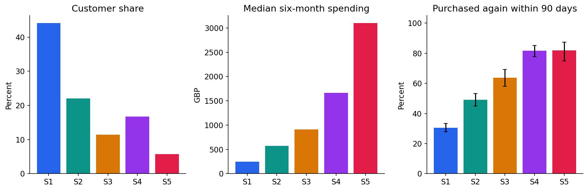
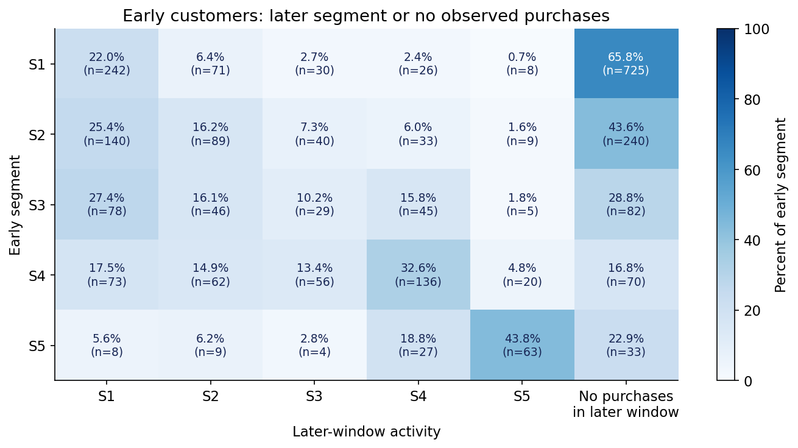

# Customer Behaviour Segmentation and Stability Analysis

An end-to-end customer analytics project using **UCI Online Retail II**. It compares a K-means baseline with probabilistic Gaussian mixture models, evaluates robustness under resampling, and tracks customer movement across matching seasonal windows.

## What the project answers

- Which purchasing patterns describe the retailer's active customers?
- How much additional detail does a probabilistic model provide over broad K-means groups?
- Are the selected groups robust to resampling and covariance assumptions?
- How do customer assignments change one year later under a frozen model?
- How do the groups differ in observed subsequent purchasing?

## Measured results

| Measure | Result |
|---|---:|
| Original transaction rows, both worksheets | 1,067,371 |
| Clean UK positive merchandise lines | 699,608 |
| Early-window active customers | 2,499 |
| Later-window active customers | 2,463 |
| Customers active in both windows | 1,349 |
| Selected K-means groups | 2 |
| Selected GMM components | 5 (full covariance) |
| Median bootstrap ARI, K-means | 0.988 |
| Median bootstrap ARI, GMM | 0.876 |
| Same segment among customers active in both windows | 41.4% |

The highest-spending-median segment contains **5.8% of early-window customers** and accounts for **38.0% of observed gross spending**. Its observed 90-day repeat-purchase rate is **81.9%**. These are observational findings, not campaign uplift or realized incremental revenue.

K-means provides broader, more geometrically separated and more stable groups. The GMM provides finer descriptions and membership probabilities, but is more sensitive to modelling choices. It is not claimed to outperform K-means on every metric. The component count is selected within a bounded 2–6 search.





## Quick start

Python **3.11+**; validated with Python 3.12. Use a virtual environment.

```bash
python -m venv .venv
# macOS / Linux:
source .venv/bin/activate
# Windows PowerShell instead: .venv\Scripts\Activate.ps1
python -m pip install -r requirements.txt
python scripts/run_analysis.py --bootstrap 20
python -m pytest -q
```

Run commands from the repository root. The first run downloads the official workbook and can take several minutes to read it. Later runs use a local cache. Delete `data/processed/uk_purchases.pkl` before rerunning if you modify raw data or cleaning rules.

### Notebook

Open [notebooks/customer_segmentation.ipynb](notebooks/customer_segmentation.ipynb) in VS Code, Jupyter, or another notebook interface. It includes executed outputs, explanations, formulas, and six figures. The notebook imports the repository's Python modules, so keep it inside this repository.

To install a notebook interface:

```bash
python -m pip install jupyterlab
jupyter lab notebooks/customer_segmentation.ipynb
```

To execute automatically and export a readable HTML copy:

```bash
python scripts/execute_notebook.py
```

In environments that prohibit kernel sockets, the equivalent cell-by-cell IPython execution is available:

```bash
python scripts/execute_notebook.py --in-process
```

[Open the HTML notebook](notebooks/customer_segmentation.html) to read the analysis without running Python. The environment must be able to access the official UCI URL on the first data download.

### Score a customer-feature table

```bash
python scripts/score_customers.py data/example_customer_features.csv results/example_scores.csv
```

The example rows are synthetic demonstrations. Real inputs need one row per `customer_id`, the four feature columns, and `window_days=182`. Features must follow the same purchase cleaning, observation period, and GBP units. The command uses the saved scaler and model without retraining.

## Methodology

1. Read both source worksheets and record a sequential cleaning audit.
2. Remove exact duplicates, invalid customer IDs, cancellations, non-positive transactions, and non-merchandise codes; restrict to UK customers.
3. Build recency, distinct-invoice frequency, gross merchandise spending, and product diversity.
4. Apply `log1p` and scaling fitted on a 70% early-customer training subset; use the remaining 30% for selection diagnostics.
5. Compare K-means candidates using holdout silhouette; compare GMM candidates using training BIC, convergence, minimum group size, and independent holdout log-likelihood diagnostics.
6. Refit each selected configuration on all early-window customers. GMM covariance is regularized with a 0.01 floor in standardized units.
7. Assess robustness with 20 bootstrap refits per model, including refitting the scaler, evaluated on fixed anchor customers.
8. Apply the frozen early model to later features; distinguish common active customers, those without later-window purchases, and later-active customers not seen in the early window.
9. Observe subsequent 90-day purchases for descriptive interpretation, with Wilson intervals for repeat-purchase rates.
10. Stress-test mixture covariance regularization and export tables, figures, and a fitted scoring artifact.

Observation windows are `[2009-12-01, 2010-06-01)` and `[2010-12-01, 2011-06-01)`, both 182 days. Later features and future purchasing outcomes do not enter initial model fitting or model selection. Matching seasons reduces, but does not eliminate, temporal differences.

## Repository layout

| Path | Purpose |
|---|---|
| `notebooks/` | Executed notebook and HTML reading copy |
| `src/customer_segmentation/` | Data, features, models, evaluation, reporting, and pipeline |
| `scripts/` | Data preparation, analysis, notebook execution, and scoring commands |
| `tests/` | Checks for transaction accounting, cutoffs, order aggregation, probabilities, and cohort coverage |
| `results/` | Aggregate metric tables, audit, provenance, and six figures |
| `artifacts/segmentation.joblib` | Fitted scaler, mixture, feature definitions, and display labels |
| `data/README.md` | Dataset source, license, and definitions |
| `data/example_customer_features.csv` | Synthetic scoring examples |
| `docs/project_walkthrough.md` | Explanation of the analysis and interview discussion points |
| `docs/publishing.md` | Publish the existing Git history to an empty GitHub repository |

Raw data and local customer-level tables are excluded from Git. The dataset ZIP and workbook checksums are recorded in `results/data_manifest.json`. Results are deterministic in the tested environment; exact numerical values can vary slightly across library/platform versions.

## Interpretation and limitations

- Spending is gross positive merchandise spending, **not net revenue, margin, or customer lifetime value**. Returns are excluded.
- No authoritative labelled customer segments exist; classification accuracy is not reported.
- Mixture posteriors are probabilities under the fitted model, not independently calibrated business-segment probabilities.
- Frequency and diversity are counts approximated with Gaussian components after transformation. Regularization sensitivity is reported.
- The observed temporal change can reflect customer behaviour, retailer changes, calendar effects, sample coverage, or model limitations.
- A customer without purchases in the later window is not labelled permanently churned. A later-active customer absent from the early window is not automatically a genuinely new customer.
- Bootstrap ranges summarize empirical configuration robustness; they are not population confidence intervals and do not cover selection uncertainty.
- Duplicates, returns, merchandise-code rules, and the handling of large business customers can materially affect conclusions. Large customers are retained and identified in profiles, not automatically deleted as errors.
- Findings from one retailer do not establish generalization to another retailer or the causal value of targeted marketing.

## Data and method references

- Daqing Chen, *Online Retail II*, UCI Machine Learning Repository: https://doi.org/10.24432/C5CG6D. Dataset license: **CC BY 4.0**.
- Official data page: https://archive.ics.uci.edu/dataset/502/online+retail+ii.
- Scikit-learn mixture selection: https://scikit-learn.org/stable/auto_examples/mixture/plot_gmm_selection.html.
- Scikit-learn clustering evaluation: https://scikit-learn.org/stable/modules/clustering.html#clustering-performance-evaluation.

Code is provided under the MIT license. The dataset has its own license.
